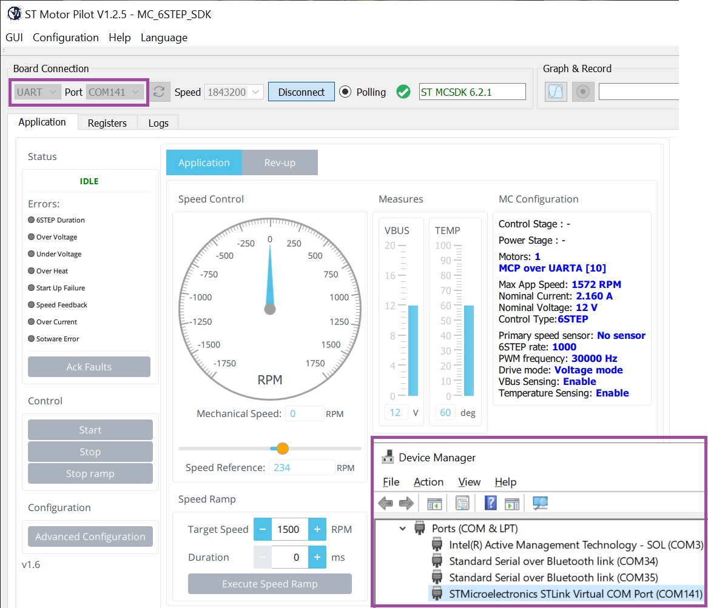
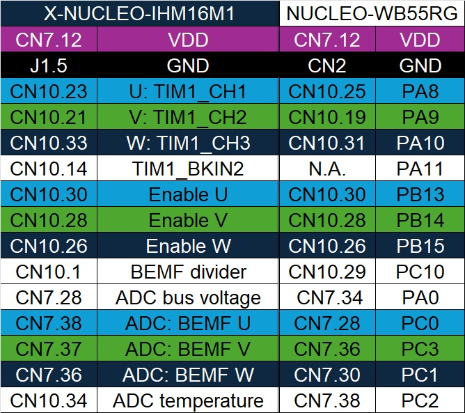
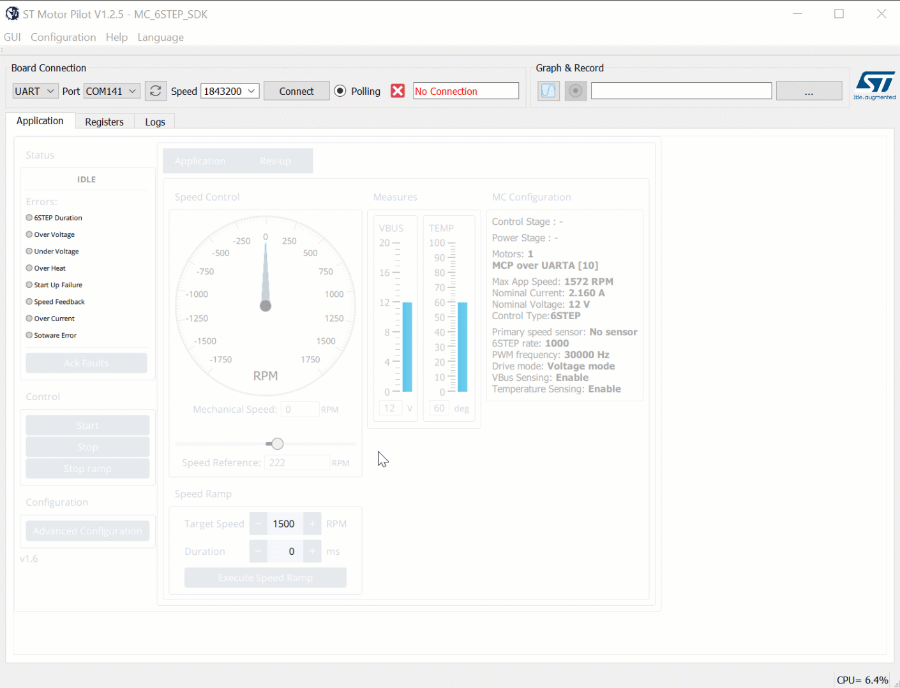

# STM32WB55_Gimbal_6steps_sensorless

* The STM32WB55_Gimbal_6steps_sensorless project is based on STM32G431 / [P-NUCLEO-IHM03](https://www.st.com/en/evaluation-tools/p-nucleo-ihm03.html) [MotorControl Workbench v6](https://www.st.com/en/embedded-software/x-cube-mcsdk.html) project.
* This application is an example of running the Gimbal motor GBM2804H-100T:
    * Press NUCLEO-WB55RG's SW1 to either start or stop spinning the Gimbal motor.

## Hardware Needed

  * One [NUCLEO-WB55RG](https://www.st.com/en/evaluation-tools/nucleo-wb55rg.html)
  * One [P-NUCLEO-IHM03](https://www.st.com/en/evaluation-tools/p-nucleo-ihm03.html) with 12V wall power
  * One GBM2804H-100T Gimbal motor

## Software Needed

  * IDE, choose your preferred one:

    * [STM32CubeIDE](https://www.st.com/en/development-tools/stm32cubeide.html) - please use high code optimization level

    * [IAR EWARM](https://www.iar.com/products/architectures/arm/iar-embedded-workbench-for-arm/)

    * [Keil MDK-ARM](https://developer.arm.com/Tools%20and%20Software/Keil%20MDK) - please use high code optimization level

  * OPTIONAL - Motor Pilot from [MotorControl Workbench v6](https://www.st.com/en/embedded-software/x-cube-mcsdk.html)

    

## User's Guide

1) Build this STM32WB55_Gimbal_6steps_sensorless project using one of the IDEs.

2) Wire the NUCLEO-WB55RG and P-NUCLEO-IHM03 with the 12V wall supply and the Gimbal motor:

  

3) Flash this project to the NUCLEO-WB55RG board.

4) Press SW1 on the NUCLEO-WB55RG board to start or stop the Gimbal motor

5) After choosing the COM port, you can use the Motor Pilot tool to control and debug this motor application.

  

## Troubleshooting

**Caution** : Issues and the pull-requests are **not supported** to submit problems or suggestions related to the software delivered in this repository. The motor parameters are not optimized in this firmware. The STM32WB55_Gimbal_6steps_sensorless example is being delivered as-is, and not necessarily supported by ST.

**For any other question** related to the product, the hardware performance or characteristics, the tools, the environment, you can submit it to the **ST Community** on the STM32 MCUs related [page](https://community.st.com/s/topic/0TO0X000000BSqSWAW/stm32-mcus).